# SUIGEN Grafik-Templates

> Vorgefertigte Code-Templates für Diagramme und Visualisierungen

---

## 🔄 1. Ablauf-Diagramm (Mermaid)

```mermaid
%%{init: {'theme':'dark', 'themeVariables': { 'primaryColor':'#00b8c4','primaryTextColor':'#fff','primaryBorderColor':'#00b8c4','lineColor':'#00b8c4','secondaryColor':'#2e474f','tertiaryColor':'#3a5861'}}}%%
graph LR
    A["<b>1</b><br/>ANALYSE<br/>Deine aktuelle Situation"] --> B["<b>2</b><br/>IDENTIFIKATION<br/>Die echten Engpässe"]
    B --> C["<b>3</b><br/>EMPFEHLUNG<br/>Klare nächste Schritte"]

    style A fill:#2e474f,stroke:#00b8c4,stroke-width:2px,color:#fff
    style B fill:#2e474f,stroke:#00b8c4,stroke-width:2px,color:#fff
    style C fill:#2e474f,stroke:#00b8c4,stroke-width:2px,color:#fff
```



---

## 📊 2. Radar-Chart (D3.js Config)

```javascript
const radarConfig = {
  backgroundColor: '#2e474f',
  gridColor: 'rgba(255, 255, 255, 0.1)',
  axisColor: 'rgba(255, 255, 255, 0.3)',
  dataColor: '#00b8c4',
  dataFillColor: 'rgba(0, 184, 196, 0.2)',
  labelColor: '#ffffff',
  dimensions: [
    { axis: 'STRATEGIE', value: 75 },
    { axis: 'FOKUS', value: 60 },
    { axis: 'PROZESSE', value: 45 },
    { axis: 'TEAM', value: 80 },
    { axis: 'SYSTEME', value: 50 }
  ],
  levels: 5,
  maxValue: 100,
  strokeWidth: 3,
  dotRadius: 8
};
```

---

## 📈 3. Quick-Win-Matrix (HTML/CSS)

```html
<div class="quick-win-matrix">
  <div class="matrix-grid">
    <!-- Quadranten -->
    <div class="quadrant strategic">
      <h3>STRATEGISCH</h3>
      <p>Hoher Impact<br/>Hoher Aufwand</p>
    </div>
    <div class="quadrant quick-wins highlight">
      <h3>QUICK WINS ⭐</h3>
      <p>Hoher Impact<br/>Niedriger Aufwand</p>
    </div>
    <div class="quadrant ignore">
      <h3>IGNORIEREN</h3>
      <p>Niedriger Impact<br/>Niedriger Aufwand</p>
    </div>
    <div class="quadrant avoid">
      <h3>VERMEIDEN</h3>
      <p>Niedriger Impact<br/>Hoher Aufwand</p>
    </div>
  </div>

  <!-- Achsen -->
  <div class="axis x-axis">
    <span class="axis-label left">Niedriger Aufwand</span>
    <span class="axis-label right">Hoher Aufwand</span>
  </div>
  <div class="axis y-axis">
    <span class="axis-label top">Hoher Impact</span>
    <span class="axis-label bottom">Niedriger Impact</span>
  </div>
</div>

<style>
.quick-win-matrix {
  position: relative;
  width: 800px;
  height: 800px;
  background: #2e474f;
  padding: 60px;
}

.matrix-grid {
  display: grid;
  grid-template-columns: 1fr 1fr;
  grid-template-rows: 1fr 1fr;
  gap: 2px;
  width: 100%;
  height: 100%;
  position: relative;
}

.quadrant {
  background: rgba(255, 255, 255, 0.05);
  border: 1px solid rgba(255, 255, 255, 0.1);
  border-radius: 24px;
  padding: 2rem;
  display: flex;
  flex-direction: column;
  align-items: center;
  justify-content: center;
  text-align: center;
}

.quadrant.highlight {
  background: rgba(0, 184, 196, 0.2);
  border-color: #00b8c4;
  box-shadow: 0 0 40px rgba(0, 184, 196, 0.4);
}

.quadrant h3 {
  color: #ffffff;
  font-size: 1.5rem;
  font-weight: 800;
  text-transform: uppercase;
  margin-bottom: 1rem;
}

.quadrant p {
  color: #a8c0c5;
  font-size: 1rem;
  line-height: 1.6;
}

.axis {
  position: absolute;
  display: flex;
  justify-content: space-between;
}

.x-axis {
  bottom: 20px;
  left: 60px;
  right: 60px;
  border-top: 2px solid rgba(255, 255, 255, 0.3);
  padding-top: 10px;
}

.y-axis {
  left: 20px;
  top: 60px;
  bottom: 60px;
  border-right: 2px solid rgba(255, 255, 255, 0.3);
  padding-right: 10px;
  flex-direction: column;
  align-items: flex-end;
}

.axis-label {
  color: #ffffff;
  font-size: 0.875rem;
  font-weight: 700;
  text-transform: uppercase;
  letter-spacing: 0.1em;
}
</style>
```

---

## 🗓️ 4. Timeline-Roadmap (HTML/CSS)

```html
<div class="roadmap-timeline">
  <div class="timeline-line"></div>

  <div class="milestone" data-day="1-30">
    <div class="milestone-marker">
      <span class="milestone-number">1</span>
    </div>
    <div class="milestone-content">
      <h3 class="milestone-title">FUNDAMENT</h3>
      <p class="milestone-description">Tag 1-30: Quick Wins umsetzen, Basis schaffen</p>
    </div>
  </div>

  <div class="milestone" data-day="31-60">
    <div class="milestone-marker">
      <span class="milestone-number">2</span>
    </div>
    <div class="milestone-content">
      <h3 class="milestone-title">IMPLEMENTIERUNG</h3>
      <p class="milestone-description">Tag 31-60: Systeme aufbauen, Prozesse etablieren</p>
    </div>
  </div>

  <div class="milestone" data-day="61-90">
    <div class="milestone-marker">
      <span class="milestone-number">3</span>
    </div>
    <div class="milestone-content">
      <h3 class="milestone-title">OPTIMIERUNG</h3>
      <p class="milestone-description">Tag 61-90: Feintuning, Skalierung vorbereiten</p>
    </div>
  </div>
</div>

<style>
.roadmap-timeline {
  position: relative;
  background: #2e474f;
  padding: 4rem 2rem;
  display: flex;
  justify-content: space-around;
  align-items: flex-start;
  max-width: 1200px;
  margin: 0 auto;
}

.timeline-line {
  position: absolute;
  top: 50%;
  left: 10%;
  right: 10%;
  height: 3px;
  background: #00b8c4;
  box-shadow: 0 0 20px rgba(0, 184, 196, 0.3);
  transform: translateY(-50%);
  z-index: 0;
}

.milestone {
  position: relative;
  z-index: 1;
  display: flex;
  flex-direction: column;
  align-items: center;
  gap: 1.5rem;
}

.milestone-marker {
  width: 64px;
  height: 64px;
  background: #00b8c4;
  border-radius: 50%;
  display: flex;
  align-items: center;
  justify-content: center;
  box-shadow: 0 0 30px rgba(0, 184, 196, 0.4);
  position: relative;
}

.milestone-number {
  color: #2e474f;
  font-size: 2rem;
  font-weight: 900;
}

.milestone-content {
  text-align: center;
  max-width: 280px;
}

.milestone-title {
  color: #ffffff;
  font-size: 1.25rem;
  font-weight: 800;
  text-transform: uppercase;
  letter-spacing: 0.05em;
  margin-bottom: 0.5rem;
}

.milestone-description {
  color: #a8c0c5;
  font-size: 0.9375rem;
  line-height: 1.6;
}
</style>
```

---

## △ 5. Fokus-Dreieck (SVG)

```svg
<svg width="600" height="600" viewBox="0 0 600 600" xmlns="http://www.w3.org/2000/svg">
  <!-- Background -->
  <rect width="600" height="600" fill="#2e474f"/>

  <!-- Dreieck mit Glow -->
  <defs>
    <filter id="glow">
      <feGaussianBlur stdDeviation="8" result="coloredBlur"/>
      <feMerge>
        <feMergeNode in="coloredBlur"/>
        <feMergeNode in="SourceGraphic"/>
      </feMerge>
    </filter>
  </defs>

  <!-- Hauptdreieck -->
  <path
    d="M 300 100 L 500 450 L 100 450 Z"
    fill="none"
    stroke="#00b8c4"
    stroke-width="4"
    filter="url(#glow)"
  />

  <!-- Eckpunkte -->
  <circle cx="300" cy="100" r="10" fill="#00b8c4"/>
  <circle cx="500" cy="450" r="10" fill="#00b8c4"/>
  <circle cx="100" cy="450" r="10" fill="#00b8c4"/>

  <!-- Labels -->
  <text x="300" y="80" text-anchor="middle" fill="#ffffff" font-size="20" font-weight="800" font-family="Inter">
    KLARHEIT
  </text>
  <text x="80" y="490" text-anchor="middle" fill="#ffffff" font-size="20" font-weight="800" font-family="Inter">
    PRIORITÄT
  </text>
  <text x="520" y="490" text-anchor="middle" fill="#ffffff" font-size="20" font-weight="800" font-family="Inter">
    ROADMAP
  </text>

  <!-- Center -->
  <circle cx="300" cy="300" r="60" fill="rgba(0, 184, 196, 0.2)" stroke="#00b8c4" stroke-width="2"/>
  <text x="300" y="310" text-anchor="middle" fill="#ffffff" font-size="28" font-weight="900" font-family="Inter">
    90 TAGE
  </text>
</svg>
```

---

## 📐 6. Fokus-Check Score-Visualisierung

```html
<div class="score-display">
  <div class="score-circle">
    <svg width="200" height="200" viewBox="0 0 200 200">
      <!-- Background Circle -->
      <circle
        cx="100"
        cy="100"
        r="80"
        fill="none"
        stroke="rgba(255, 255, 255, 0.1)"
        stroke-width="12"
      />

      <!-- Progress Circle -->
      <circle
        cx="100"
        cy="100"
        r="80"
        fill="none"
        stroke="#00b8c4"
        stroke-width="12"
        stroke-linecap="round"
        stroke-dasharray="502.4"
        stroke-dashoffset="125.6"
        transform="rotate(-90 100 100)"
        filter="url(#glow)"
      />

      <!-- Score Text -->
      <text x="100" y="95" text-anchor="middle" fill="#ffffff" font-size="48" font-weight="900" font-family="Inter">
        75
      </text>
      <text x="100" y="120" text-anchor="middle" fill="#a8c0c5" font-size="14" font-weight="700" font-family="Inter">
        PUNKTE
      </text>
    </svg>
  </div>

  <div class="score-label">
    <h3>Dein Fokus-Score</h3>
    <p>Überdurchschnittlich - Du bist auf dem richtigen Weg!</p>
  </div>
</div>

<style>
.score-display {
  display: flex;
  flex-direction: column;
  align-items: center;
  gap: 2rem;
  background: #2e474f;
  padding: 3rem;
  border-radius: 24px;
}

.score-circle {
  position: relative;
}

.score-label {
  text-align: center;
}

.score-label h3 {
  color: #ffffff;
  font-size: 1.5rem;
  font-weight: 800;
  text-transform: uppercase;
  margin-bottom: 0.5rem;
}

.score-label p {
  color: #a8c0c5;
  font-size: 1rem;
}
</style>
```

---

## 🎨 Figma Component-Struktur

```
SUIGEN Components/
├── Colors/
│   ├── Background/Dark
│   ├── Background/Dark-Lighter
│   ├── Accent/Teal
│   ├── Accent/Teal-Light
│   ├── Text/Light
│   └── Text/Muted
│
├── Typography/
│   ├── Headline/Hero
│   ├── Headline/Section
│   ├── Body/Regular
│   └── Label/Small
│
├── Effects/
│   ├── Glow/Text
│   ├── Glow/Box
│   └── Shadow/Card
│
├── Components/
│   ├── Button/Primary
│   ├── Button/Secondary
│   ├── Card/Base
│   └── Badge/Accent
│
└── Graphics/
    ├── Fokus-Audit/Ablauf
    ├── Fokus-Audit/Dreieck
    ├── Fokus-Audit/Radar
    ├── Fokus-Audit/Matrix
    └── Fokus-Audit/Timeline
```

---

## 📦 Export-Checkliste

Vor dem Export prüfen:

- [ ] Hintergrundfarbe: `#2e474f`
- [ ] Schriftarten eingebettet (Inter, JetBrains Mono)
- [ ] Transparenz für Overlays korrekt
- [ ] Glow-Effekte bei 40% Opacity
- [ ] Alle Texte in Uppercase wo erforderlich
- [ ] Border-Radius: 24px (Cards), 50px (Buttons)
- [ ] Exportformat: SVG mit Viewbox
- [ ] Fallback PNG in 2x Auflösung
- [ ] Dateiname entspricht Konvention

---

## 🔗 Integration in Next.js

```tsx
// components/graphics/FokusAuditAblauf.tsx
import Image from 'next/image';

export function FokusAuditAblauf() {
  return (
    <div className="w-full max-w-6xl mx-auto py-12">
      <Image
        src="/images/graphics/fokus-audit-ablauf-diagramm.svg"
        alt="Fokus-Audit Ablauf in 3 Phasen: Analyse, Identifikation, Empfehlung"
        width={1200}
        height={400}
        className="w-full h-auto"
        priority
      />
    </div>
  );
}
```

```tsx
// Verwendung auf Seite
import { FokusAuditAblauf } from '@/components/graphics/FokusAuditAblauf';

<section className="bg-[var(--bg-dark-lighter)] py-24">
  <div className="max-w-6xl mx-auto px-4">
    <h2 className="headline-section text-center mb-16">
      Der Ablauf
    </h2>
    <FokusAuditAblauf />
  </div>
</section>
```

---

**Nächste Schritte:**
1. Grafiken in Figma erstellen
2. Als SVG exportieren nach `/public/images/graphics/`
3. Components in `/components/graphics/` anlegen
4. In Seiten einbinden
5. Mobile Responsiveness testen

**Tools:**
- Figma (für Design)
- SVGOMG (für SVG-Optimierung)
- ImageOptim (für PNG-Kompression)
